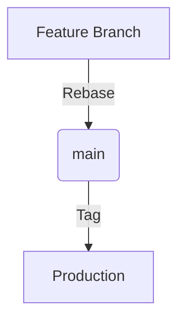

# Agency Swarm Base Template

This repository serves as an example implementation of the Agency Swarm framework, showcasing example agents, tools, and a CI testing workflow.

## Project Description

This template provides a starting point for building AI agent teams using the Agency Swarm framework. It includes:

- Example agent implementations
- Custom tool examples
- A CI testing workflow
- A comprehensive test suite
- A `.cursorrules` file containing the prompt for AI assistance

The purpose of this template is to demonstrate best practices for setting up an Agency Swarm project and to provide a foundation that developers can build upon for their own AI agent applications.

## Getting Started

1. Clone this repository:

   ```bash
   git clone https://github.com/<this_repo>>
   cd <repo_name>>
   ```

2. Set up development environment:
   ```bash
   chmod +x setup-dev-env.sh
   ./setup-dev-env.sh  # Creates virtual environment and base structure
   ```

3. Activate virtual environment:
   ```bash
   # Mac/Linux
   source venv/bin/activate
   
   # Windows (Command Prompt)
   venv\Scripts\activate.bat
   
   # Windows PowerShell
   .\venv\Scripts\Activate.ps1
   ```
   *For IDEs:* Most modern editors (PyCharm, VSCode) will auto-detect the venv. Manually select `venv` as Python interpreter if needed.

4. Install dependencies within activated environment:
   ```bash
   pip install -r requirements.txt
   ```

5. Set up OpenAI API key:
   ```bash
   cp .env.example .env  # Then edit .env with your API key
   ```
   The `dotenv` package will automatically load this environment file.

5. Explore the `agents` and `tools` directories to see example implementations.

6. Run the example agency:
   ```python
   python <Agency_Name>/LocalAgency.py
   ```

## Development Workflow & Standards

If you haven't already, watch [How to Use Git & GitHub Playbook](https://www.notion.so/vrsen-ai/How-to-Use-Git-GitHub-Playbook-11a5bd4b16a680c39ab0cc9209abe521)

As a quick overview, defintely check out this excellent guide created by the illustrious Merlin Rabens: [Mastering Git & GitHub for Effective Collaboration](https://merlinrabens.com/)

### Linear Git History Enforcement
We enforce a clean, linear history without merge commits:
```bash
* a1b2c3d (HEAD -> main) Add feature Z
* e4f5g6h Refactor module Y
* i7j8k9l Fix bug in component X
```

**Why Linear?**
- Enables efficient debugging with `git bisect`
- Clear chronological change tracking
- Eliminates merge commit noise

**Enforcement:**
```bash
# Always rebase when updating
git pull --rebase origin main
```

### 🔄 Git Workflow


1. **Branch Strategy & Commit Convention**
   ```bash
   # Branch Format: prefix/DEV-####-SP-#-description
   git checkout -b feat/DEV-2157-SP-3-add-search-api
   
   # Commit Format: prefix/SP-#: Description
   git commit -m "feat/SP-3: Add search API endpoint"
   ```
   - Branch directly from `main`
   - Single task focus per branch
   - Branch & commit naming components:
     * `prefix/` - Semantic prefix indicating change type
     * `DEV-####` - Notion task ID (copy from task properties, branches only)
     * `SP-#` - Story point estimate (1,2,3,5,8,13)
     * Description in kebab-case for branches, sentence case for commits

   **Semantic Prefix Legend:**
   ```
   feat/   - New feature or significant enhancement
   fix/    - Bug fixes and patches
   hotfix/ - Critical production fixes
   refac/  - Code restructuring without behavior change
   docs/   - Documentation updates only
   test/   - Adding or modifying tests
   style/  - Code style/formatting changes
   perf/   - Performance improvements
   chore/  - Maintenance tasks, dependencies, etc.
   ci/     - CI/CD pipeline changes
   ```

   **Examples:**
   Branch names:
   ```bash
   feat/DEV-2157-SP-3-add-search-api
   fix/DEV-3891-SP-1-login-validation
   refac/DEV-4200-SP-5-optimize-auth-flow
   ```
   
   Commit messages:
   ```bash
   feat/SP-3: Add search API endpoint with rate limiting
   fix/SP-1: Resolve login validation edge case
   refac/SP-5: Optimize authentication flow for better performance
   ```

**Story Points (SP):**
- `SP-1` - Quick fix (< 1 hour)
- `SP-2` - Simple task (2-4 hours)
- `SP-3` - Medium task (1 day)
- `SP-5` - Complex task (2-3 days)
- `SP-8` - Major feature (3+ days)
- `SP-13` - Project milestone (5+ days)

2. **Commit Standards**
   - Atomic, self-contained changes
   - Imperative mood ("Add feature" not "Added feature")
   - Max 24h between commits
   - Short & precise messages
   - Never repeat previous commits
   - Self-contained changes only

3. **PR Management**
   - "Rebase and merge" only to maintain linear history
   - Max 3 days old
   - Attach Notion task link
   - PM-controlled merges to `main`

### Essential Commands
```bash
# Update branch safely with latest main
git pull --rebase origin main

# Add forgotten changes to last commit
git commit --amend --no-edit

# Create PR quickly
git push --set-upstream origin $(git branch --show-current)

# Revert safely
git revert <commit-hash>

# Rebase with auto-stash for local changes
git pull --rebase --autostash

# Add all modified files and commit
git commit --all --message "feat/SP-3: your message"
```

### Branch Management
- Branch directly from `main`
- Branch naming convention: `prefix/DEV-####-SP-#-description`
  * Choose appropriate semantic prefix (feat/, fix/, etc.)
  * Get `DEV-####` from Notion task properties
  * Include `SP-#` based on estimated effort
  * Use kebab-case for description
- Keep branches small and focused
- Delete branches after merge
- Never push directly to `main`
- Always create PR for changes
- Attach PR to Notion task

### Protected Branch Policy
- `main` - Production code (PM access only)
- All changes via PR with rebase
- Linear history enforced
- Pre-commit checks required

### Development Flow
1. Create branch from `main`
2. Make atomic commits
3. Rebase onto latest main
4. Create PR
5. PM reviews and merges via rebase

## Code Quality Enforcement

### Pre-commit Checks
```bash
# Advisory checks (no auto-fix)
pre-commit run --all-files

# Format main files
ruff format main.py run_tests.py tools/

# Lint check
ruff check main.py run_tests.py tools/ --no-fix --show-fixes
```

## Running Tests

Run the test suite:
```bash
pytest tests
```

## CI/CD Pipeline

Our GitHub Actions workflow includes:
- Code formatting check
- Linting
- Security scanning
- Unit tests
- Integration tests

## Security Considerations

- No credentials in code
- Use environment variables
- Regular dependency updates
- Security scanning in CI/CD

## Best Practices

1. **Code Review**
   - Review for performance
   - Check security implications
   - Verify test coverage
   - Ensure documentation

2. **Branch Management**
   - Keep branches up to date
   - Delete merged branches
   - Use meaningful branch names

3. **Documentation**
   - Update README for new features
   - Document API changes
   - Add inline code comments

4. **Testing**
   - Write tests for new features
   - Maintain test coverage
   - Test edge cases

## Troubleshooting

If pre-commit hooks fail:
1. Review the error messages
2. Run format and lint fixes
3. Commit changes
4. If issues persist, consult team lead

## Additional Resources

- [Conventional Commits](https://www.conventionalcommits.org/)
- [Pre-commit Documentation](https://pre-commit.com/)
- [Ruff Documentation](https://docs.astral.sh/ruff/)

## Protected Branch Policy
- `main` - Production (PM access only)
- All changes via PR
- Linear history enforced
- Pre-commit checks required

## Development Flow
1. Branch from `main`
2. Develop with atomic commits
3. Rebase onto latest main
4. Push and create PR
5. Review → Rebase Merge → Delete branch