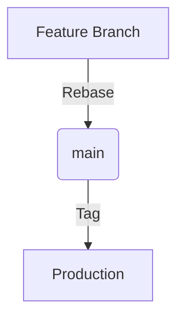

# Agency Swarm Base Template

This repository serves as an example implementation of the Agency Swarm framework, showcasing example agents, tools, and a CI testing workflow.

## Project Description

This template provides a starting point for building AI agent teams using the Agency Swarm framework. It includes:

- Example agent implementations
- Custom tool examples
- A CI testing workflow
- A comprehensive test suite
- A `.cursorrules` file containing the prompt for AI assistance

The purpose of this template is to demonstrate best practices for setting up an Agency Swarm project and to provide a foundation that developers can build upon for their own AI agent applications.

## Getting Started

1. Clone this repository:

   ```bash
   git clone https://github.com/<this_repo>>
   cd <repo_name>>
   ```

2. Install the required dependencies:

   ```bash
   pip install -r requirements.txt
   ```

3. Set up your OpenAI API key:
   Use the `.env.example` file to create your own `.env` file. It will be read automatically by `dotenv`.

4. Set up development environment:
   ```bash
   chmod +x setup-dev-env.sh
   ./setup-dev-env.sh
   ```

5. Explore the `agents` and `tools` directories to see example implementations.

6. Run the example agency:
   ```python
   python <Agency_Name>/LocalAgency.py
   ```

## Development Workflow & Standards

If you haven't already, watch [How to Use Git & GitHub Playbook](https://www.notion.so/vrsen-ai/How-to-Use-Git-GitHub-Playbook-11a5bd4b16a680c39ab0cc9209abe521)

### Linear Git History Enforcement
We enforce a clean, linear history without merge commits:
```bash
* a1b2c3d (HEAD -> main) Add feature Z
* e4f5g6h Refactor module Y
* i7j8k9l Fix bug in component X
```

**Why Linear?**
- Enables efficient debugging with `git bisect`
- Clear chronological change tracking
- Eliminates merge commit noise

**Enforcement:**
```bash
# Always rebase when updating
git pull --rebase origin main
```

### 💬 Atomic Commit Convention
```bash
TYPE/SP-X: Brief Description

# Real Examples
FEAT/SP-5: OAuth2 Social Login Integration
FIX/SP-2: Resolve API Rate Limiting Bug
REFAC/SP-3: Optimize Database Query Performance
DOCS/SP-1: Update API Authentication Docs
TEST/SP-2: Add E2E Tests for Payment Flow
```

**Type Categories:**
- `FEAT` - New feature
- `FIX` - Bug fix
- `REFAC` - Code restructuring/refactoring
- `DOCS` - Documentation
- `TEST` - Testing changes

**Story Points (SP):**
- `SP-1` - Quick fix (< 1 hour)
- `SP-2` - Simple task (2-4 hours)
- `SP-3` - Medium task (1 day)
- `SP-5` - Complex task (2-3 days)
- `SP-8` - Major feature (3+ days)
- `SP-13` - Project milestone (5+ days)

### 🔄 Git Workflow



1. **Branch Strategy**
   ```bash
   git checkout -b feat/SP-3-add-feature
   ```
   - Branch directly from `main`
   - Single task focus per branch
   - Delete after merge

2. **Commit Standards**
   - Atomic, self-contained changes
   - Imperative mood ("Add feature" not "Added feature")
   - Max 24h between commits

3. **PR Management**
   - "Rebase and Merge" only
   - Max 3 days old
   - Attach Notion task link
   - PM-controlled merges

### Essential Commands
```bash
# Update branch safely
git pull --rebase origin main

# Fix last commit
git commit --amend --no-edit

# Create PR quickly
git push --set-upstream origin $(git branch --show-current)

# Revert safely
git revert <commit-hash>
```

## Code Quality Enforcement

### Pre-commit Checks
```bash
# Advisory checks (no auto-fix)
pre-commit run --all-files

# Format main files
ruff format main.py run_tests.py tools/

# Lint check
ruff check main.py run_tests.py tools/ --no-fix --show-fixes
```

## Running Tests

Run the test suite:
```bash
pytest tests
```

## CI/CD Pipeline

Our GitHub Actions workflow includes:
- Code formatting check
- Linting
- Security scanning
- Unit tests
- Integration tests

## Security Considerations

- No credentials in code
- Use environment variables
- Regular dependency updates
- Security scanning in CI/CD

## Best Practices

1. **Code Review**
   - Review for performance
   - Check security implications
   - Verify test coverage
   - Ensure documentation

2. **Branch Management**
   - Keep branches up to date
   - Delete merged branches
   - Use meaningful branch names

3. **Documentation**
   - Update README for new features
   - Document API changes
   - Add inline code comments

4. **Testing**
   - Write tests for new features
   - Maintain test coverage
   - Test edge cases

## Troubleshooting

If pre-commit hooks fail:
1. Review the error messages
2. Run format and lint fixes
3. Commit changes
4. If issues persist, consult team lead

## Additional Resources

- [Conventional Commits](https://www.conventionalcommits.org/)
- [Pre-commit Documentation](https://pre-commit.com/)
- [Ruff Documentation](https://docs.astral.sh/ruff/)

## Protected Branch Policy
- `main` - Production (PM access only)
- All changes via PR
- Linear history enforced
- Pre-commit checks required

## Development Flow
1. Branch from `main`
2. Develop with atomic commits
3. Rebase onto latest main
4. Push and create PR
5. Review → Rebase Merge → Delete branch